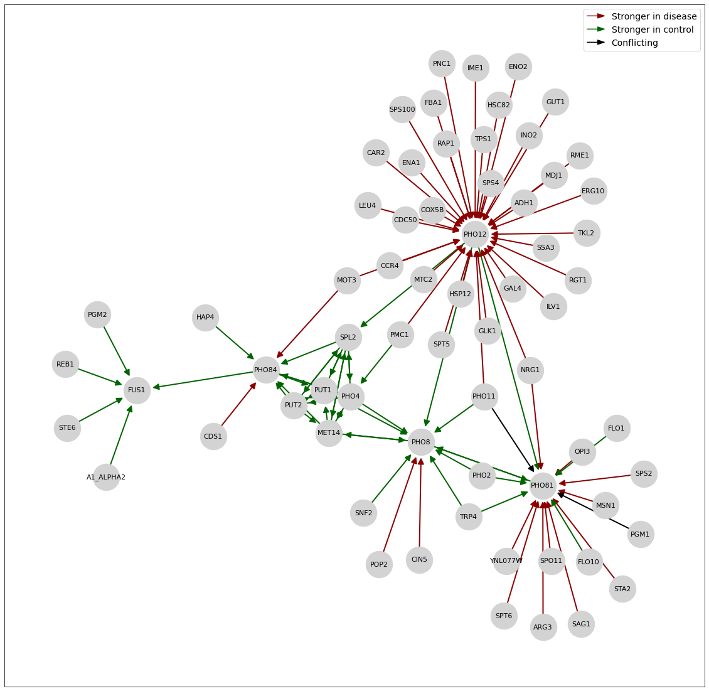

# BoostDiff 
BoostDiff (Boosted Differential Trees) - Tree-based Inference of Differential Networks from Gene Expression Data


## General info
BoostDiff is a tree-based method for inferring differential networks from large-scale transcriptomics data 
by simultaneously comparing gene expression  from two biological conditions (e.g. disease vs. control conditions). 
The network is inferred by building modified AdaBoost ensembles of differential trees as base learners. BoostDiff modifies regression trees to use differential variance improvement (DVI) as the novel splitting criterion. 

## Installation

To install the package from git:

```
conda create --name bdenv python=3.7
conda activate bdenv
conda install numpy pandas networkx pandas matplotlib cython

git clone https://github.com/gihannagalindez/boostdiff_inference.git  && cd boostdiff_inference
pip install .
```


## Data input

BoostDiff accepts two filenames corresponding to gene expression matrices from the disease and control conditions.
Each input is a tab-separated file. The rows correspond to genes, while the columns correspond to samples. Note that the two inputs should have the same set of features, where the first column should be named "Gene".

Disease expression data:
| Gene  |   Disease1   |   Disease2  | Disease3  | 
|-------------------|-----------|-----------|------|
| ACE2   | 0.345  | 0.147  |0.267 | 
| APP   | 0.567  | 0.794  | 0.590 | 

Control expression data:
| Gene  |   Control1   |   Control2  | Control3  | 
|-------------------|-----------|-----------|------|
| ACE2   | 0.084  | 0.147  |0.91 | 
| APP   | 0.567  | 0.794  | 0.590 | 


## Example


Import the BoostDiff package:

```python
from boostdiff.main_boostdiff import BoostDiff
```

### Step 1: Run BoostDiff 

```python

file_disease = "/path/to/boostdiff_inference/data/expr_disease.txt"
file_control = "/path/to/boostdiff_inference/data/expr_control.txt"
output_folder = "/path/to/output/"

n_estimators = 100
n_features = 50
n_subsamples = 50
keyword = "test"
n_processes = 2

model = BoostDiff()
model.run(file_disease, file_control, output_folder, n_estimators, \
          n_features, n_subsamples, keyword=keyword, n_processes=n_processes)

```

BoostDiff will output two txt files and a folder containing the plots for the training progression for the modified AdaBoost models.
<br />
<br /> Note that BoostDiff runs the algorithm twice:
<br /> Run 1: The disease condition will be used as the target condition (with control condition as baseline). Results will be generated in the subfolder "disease".
<br /> Run 2: The control/healthy condition will be used as the target condition (with disease condition as baseline).  Results will be generated in the subfolder "control".
<br /> <br /> In each subfolder, the first txt file shows the data for the mean difference in prediction error between the disease and control samples after training the boosted differential trees. The second txt file contains the raw output network.

###  Step 2: Filtering

To obtain the final differential network, the raw network should be filtered for target genes in which BoostDiff found a more predictive model for the target condition. This additional step is crucial and part of the pipeline, as a trained model will not always be more predictive of a target condition. 

Sample processing for the run where disease condition was used as the target condition:

```python
import boostdiff.postprocessing as pp

# Specify the output files containing the mean difference in prediction error after running the BoostDiff algorithm
file_diff_dis = "/path/to/output/disease/differences_test.txt"
file_diff_con = "/path/to/output/control/differences_test.txt"

# Specify the output file containing the raw network output after running the BoostDiff algorithm
file_net_dis = "/path/to/output/disease/boostdiff_network_test.txt"
file_net_con = "/path/to/output/control/boostdiff_network_test.txt"

# Filter the raw output based on the no. of top targets in the differences files
# Then the top 50 edges for the run where the disease condition is the target condition
# Also the top 50 edges for the run where the control condition is the target condition
df_dis = pp.filter_network(file_net_dis, file_diff_dis, n_top_targets=10, n_top_edges=100)
df_con = pp.filter_network(file_disease, file_diff_dis, n_top_targets=10, n_top_edges=50)

# Example for real, large-scale datasets: filtering based on 3rd percentile with the p parameter 
# df_filtered = pp.filter_network(file_net, file_diff, p=3, n_top_edges=100)

# For plotting the differential network
# Colorize by condition
df_both = pp.colorize_by_condition(df_dis, df_con)
# Generate and save the plot
file_grn = "/path/to/output/diff_grn.png"
pp.plot_grn(df_both, layout="graphviz_layout", show_conflicting=True, filename=file_grn)


# Save the final differential network to file
file_output = "/path/to/output/filtered_network_disease.txt"
df_filtered.to_csv(file_output, sep="\t")
```
Here is a sample differential network:

##  References

[1] Pedregosa, F., et al. (2011). Scikit-learn: Machine learning in Python. the Journal of machine Learning research, 12, 2825-2830.
<br /> [2] Huynh-Thu, V. A., Irrthum, A., Wehenkel, L., & Geurts, P. (2010). Inferring regulatory networks from expression data using tree-based methods. PloS one, 5(9), e12776.

## Contact 
Gihanna Galindez: gihanna.galindez@plri.de
